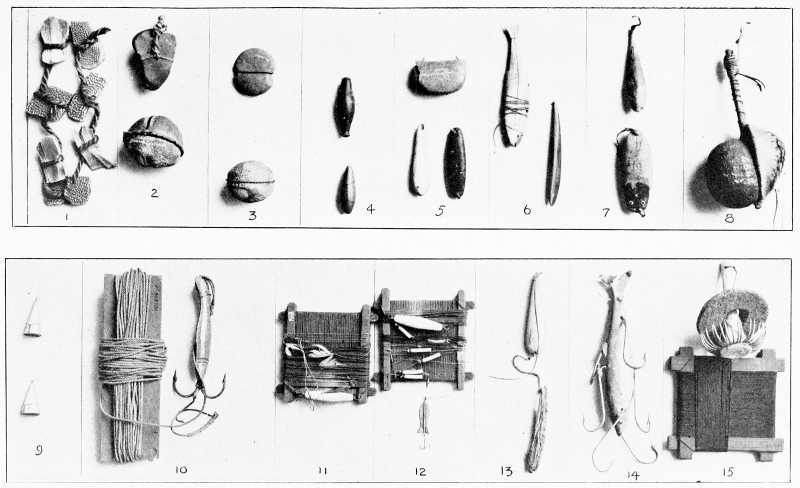

# Line and Sinker

Line and Sinker (LaS) works with WebHooks from multiple services in order to
bridge them together. Think of it as a personal ifttt instance for development
and infrastructure tooling.

## Configuration

All configuration is done using environment variables to facilitate easy
deployment in a docker container.

Global settings:

Environment variable | Description
-------------------- | --------------------------------------------------------
 `LAS_BASE_URL`      | Base web-facing URL at which LaS is accessible, used to generate hook URLs
 `LAS_SECRET`        | Random string used to generate secure hook URLs

### URL format

LaS accepts WebHook calls to URLs in the format of
`/hook/<service>/<identifier>/<hash>`, where `<service>` is the service calling
(e.g. GitHub, Jenkins), `<identifier>` is some service-specific identifier for
the hook (e.g. the name of a repository or project), and `<hash>` is a
hex-encoded sha-256 hash of the service, LaS secret, and identifier
concatenated together. The secret prevents anyone that discovers the endpoint
from triggering hooks spuriously or maliciously.

## Supported services

### Gitea

Environment variable | Description
-------------------- | --------------------------------------------------------
 `LAS_GITEA_URL`     | Base URL of the Gitea instance to connect to
 `LAS_GITEA_TOKEN`   | Application token to use to authenticate to Gitea

LaS automatically adds itself as a hook for all repositories it has access to
using the given token.

### Jenkins

Environment variable | Description
-------------------- | --------------------------------------------------------
 `LAS_JENKINS_URL`   | Base URL of the Jenkins instance to connect to
 `LAS_JENKINS_USER`  | Username of the Jenkins account to use to connect
 `LAS_JENKINS_PASSWORD` | Password of the Jenkins account to use

LaS accepts Jenkins webhooks but does not automatically create them. It can
start Jenkins jobs in response to other events.

### ReportBot

Environment variable | Description
-------------------- | --------------------------------------------------------
 `LAS_REPORTBOT_ADDRESS` | The host:port combination to send messages to
 `LAS_REPORTBOT_PREFIX`  | The text to send to the socket before any messages (e.g. API key)

LaS can send messages to a ReportBot instance (sending plain text over a TCP
connection with a specified prefix).
